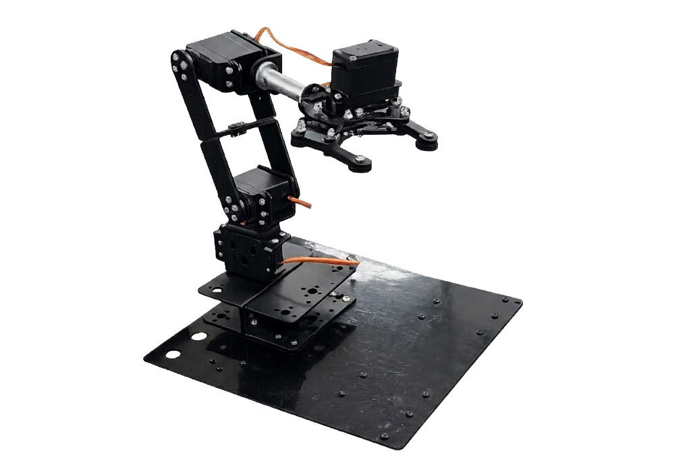
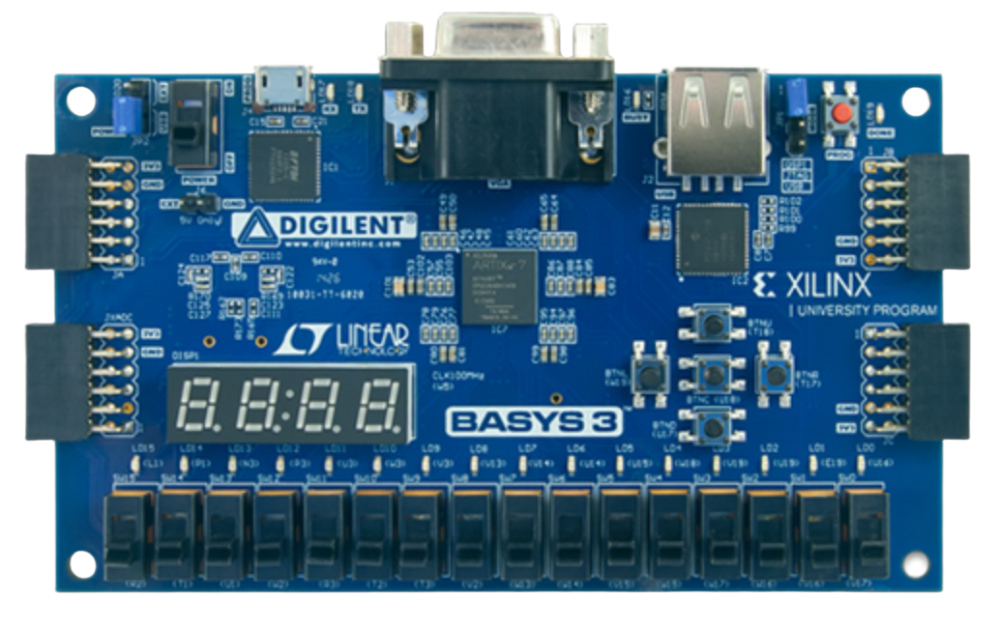

<div align="center">

# 🦾 MimicArm

### FPGA 순차회로 기반 Teach & Playback 로봇 팔

<p>
  
  
  
  
  
</p>


<p>
  
  &nbsp;&nbsp;
  
</p>

**보드의 버튼과 스위치만으로 3축 로봇 팔을 조작하고, 원하는 자세를 D-FF 레지스터 뱅크에 기억시킨 뒤 부드럽게 자동 재생하는 순수 순차회로 설계 프로젝트입니다.**

<!-- TODO: 시연 영상 업로드 후 링크 추가
[▶ 동작 시연 영상](https://...)
-->

</div>

---

## 1. Project Overview

산업용 로봇 팔의 **Teach & Playback**(작업자가 자세를 가르치면 그대로 반복 재생) 원리를, 디지털 논리회로 수업에서 배운 D-FF·카운터·비교기만으로 구현하는 것이 목표였습니다.

설계상 가장 중요한 결정은 **무엇을 쓰지 않을 것인가**였습니다. 아날로그 조이스틱(XADC), 대용량 메모리(BRAM IP), 나눗셈 연산자 — 세 가지를 모두 배제하고 보드 내장 입력과 D-FF 레지스터, 곱셈·비교만으로 전체 기능을 구성했습니다. 그 결과 설계 전체가 파형 시뮬레이션으로 추적 가능하고, IP 블랙박스 없이 동작 원리를 끝까지 설명할 수 있는 구조가 되었습니다.

"부드러운 재생"은 보통 시작각과 목표각 사이를 보간(interpolation)하는 나눗셈으로 구현하지만, 여기서는 **일정 주기마다 현재각을 ±1씩 목표각으로 접근시키는 증분 보간**으로 나눗셈 없이 해결했습니다. PWM 듀티 계산 역시 `(2.0 ms − 1.0 ms) / 180`을 파라미터로 미리 계산해두고 런타임에는 곱셈만 수행합니다.

| 항목 | 내용 |
|---|---|
| 프로젝트 형태 | 팀 프로젝트 (3인) <!-- TODO: 본인 담당 모듈/역할을 확정해 주세요 --> |
| 담당 범위 | <!-- TODO: 예) mode_fsm, reg_bank 설계 / interp·pwm_servo 설계 / 입력·표시부 --> |
| 대상 보드 | Digilent Basys 3 (Xilinx Artix-7, XC7A35T) |
| System Clock | 100 MHz (`create_clock -period 10.00`) |
| HDL | Verilog |
| Tool | Xilinx Vivado |
| 액추에이터 | 서보모터 ×4 (Base / Shoulder / Elbow / Gripper), Pmod JA 출력 |
| 설계 제약 | XADC · BRAM IP · 나눗셈 연산자 **미사용** — 순수 순차회로 |

---

## 2. Key Features

| 기능 | 구현 내용 |
|---|---|
| **3-Mode FSM** | 스위치 2비트로 `MANUAL` / `RECORD` / `PLAY` 전환, 모드 진입 Edge에서 포인터 초기화 |
| **D-FF Register Bank** | BRAM 없이 `reg [24:0] r_mem [0:7]` — 자세 8개 저장, 비동기 읽기 |
| **25-bit Pose Word** | `{gripper 1bit, elbow 8bit, shoulder 8bit, base 8bit}` 를 한 워드로 원자 저장 |
| **Division-free Interpolation** | 10 ms마다 현재각을 목표각 쪽으로 ±1° 이동 — 나눗셈 없이 부드러운 재생 |
| **Division-free Servo PWM** | 듀티 = `MIN_DUTY + angle × STEP` (STEP은 컴파일 타임 상수) |
| **Event-aligned Dwell** | 자유 진행 카운터가 아니라 **도달이 연속 유지될 때만** 카운트 — 팔이 실제 도달 전에는 다음 자세로 넘어가지 않음 |
| **2-Stage Synchronizer + Debounce** | 메타스테이블 방지 2단 FF + 10 ms 카운터 디바운스, level/edge 두 출력 분리 |
| **Joint Select Ring** | BTNL/BTNR로 Base ↔ Shoulder ↔ Elbow 순환 선택, LED 원-핫 표시 |
| **7-Segment Multiplexing** | 약 1.5 kHz 시분할로 모드 문자(M/R/P)와 저장 개수 동시 표시 |
| **Safe Init & Guard** | 모든 관절 초기값 90°(중립), 저장된 자세가 0개면 PLAY 진입 차단 |
| **Angle Clamping** | 목표각은 0~180° 범위에서만 증감, PWM단에서 한 번 더 클램프 |

---

## 3. Operating Modes

| Mode | `i_sw_mode` | 동작 |
|---|---|---|
| **MANUAL** | `2'b00` | BTNL/BTNR로 관절 선택, BTNU/BTND로 각도 증감. 집게는 스위치로 직접 개폐 |
| **RECORD** | `2'b01` | MANUAL과 동일하게 조작하며, BTNC를 누를 때마다 현재 자세를 슬롯에 저장 (최대 8개) |
| **PLAY** | `2'b10` | 저장된 자세를 0번부터 순서대로 재생. 도달 후 1초 머무르고 다음 자세로, 마지막 자세 후 롤오버 |

```verilog
// RECORD 진입 Edge에서 카운터 클리어 — 재녹화 시 이전 기록이 섞이지 않음
wire w_enter_record = (i_sw_mode == PARAM_MODE_RECORD) && (r_sw_mode_d != PARAM_MODE_RECORD);
wire w_enter_play   = (i_sw_mode == PARAM_MODE_PLAY)   && (r_sw_mode_d != PARAM_MODE_PLAY);

// PLAY 가드: 저장된 자세가 없으면 진입을 차단하고 MANUAL 유지
if (r_pose_count == 4'd0) r_mode <= PARAM_MODE_MANUAL;
else                      r_mode <= PARAM_MODE_PLAY;
```

---

## 4. Module Hierarchy & Dataflow

<!-- TODO: assets/block_diagram.png 추가 후 주석 해제
<p align="center">
  
</p>
-->

```text
                          ┌──────────┐
   i_clk 100MHz ─────────►│ tick_gen │─ jog_tick   50 Hz (20 ms)
                          │          │─ interp_tick 100 Hz (10 ms)
                          └──────────┘

  BTNL/BTNR ─┐                        ┌──────────────┐
             ├─►│debounce│─ edge ────►│ joint_select │─ w_joint_sel[1:0] ─┐
  BTNC ──────┤   (×5)     ─ edge ──┐  └──────────────┘                    │
  BTNU/BTND ─┘              level ─┼──────────────────────────────────────┤
                                   │                                      ▼
   i_sw_mode[1:0] ─┐               │                            ┌──────────────┐
                   ▼               │                    jog_tick│  angle_ctrl  │
            ┌─────────────┐        │                   ────────►│ ±1° 목표각   │
            │  mode_fsm   │◄───────┘  i_btn_save                └──────┬───────┘
            │ MANUAL /    │◄─── r_target_reached_pulse (top)           │
            │ RECORD /    │                                     target_base/sh/el
            │ PLAY        │─ o_we, o_addr[2:0] ──┐                     │
            └──────┬──────┘─ o_pose_count[3:0]   │      {sw_gripper, el, sh, base}
                   │        ─ o_play_mode ───────┼──────────────┐      │
                   │                             ▼              │      │
                   │                     ┌──────────────┐       │      │
                   │                     │  reg_bank    │◄──────┘      │
                   │                     │ D-FF 25b × 8 │              │
                   │                     └──────┬───────┘              │
                   │                            │ o_pose_data ─────────┘
                   │                            │        (PLAY 모드에서 목표각 오버라이드)
                   ▼                            ▼
            ┌─────────────┐          ┌────────────────────┐  interp_tick
            │ seg_display │          │  interp × 3        │◄──────────
            │ 4-digit MUX │          │  현재각 ±1 접근     │
            └─────────────┘          └─────────┬──────────┘
                                               │ cur_base/sh/el
                                               ▼
                                     ┌────────────────────┐
                                     │  pwm_servo × 4     │──► JA1~JA4
                                     │  20 ms / 1~2 ms    │    서보 4개
                                     └────────────────────┘
```

| Module | 역할 |
|---|---|
| `top.v` | 전체 배선 + 도달 검출 및 이벤트 정렬 Dwell 카운터 |
| `tick_gen.v` | jog(50 Hz) / interp(100 Hz) / dwell(1 Hz) 틱 생성 |
| `debounce.v` | 2단 동기화 + 10 ms 카운터 디바운스, level/edge 분리 출력 |
| `joint_select.v` | BTNL/BTNR로 관절 인덱스 순환 (0↔1↔2) |
| `angle_ctrl.v` | 관절별 목표각 레지스터, MANUAL 증감 / PLAY 오버라이드 |
| `mode_fsm.v` | 모드 상태, 저장 개수, 재생 포인터, `we`/`addr` 생성 |
| `reg_bank.v` | D-FF 25-bit × 8 자세 저장, 비동기 읽기 |
| `interp.v` | 목표각으로 ±1씩 접근하는 증분 보간 (관절마다 1개) |
| `pwm_servo.v` | 각도 → 20 ms 주기 PWM 듀티 변환 (관절 3 + 집게 1) |
| `seg_display.v` | 4자리 7세그먼트 시분할 표시 |

---

## 5. Register Bank — BRAM 대신 D-FF

자세 하나를 **25-bit 단일 워드**로 묶어 저장합니다. 관절 각도를 따로 저장하지 않고 한 워드로 처리하므로, 쓰기·읽기 시 필드 간 타이밍이 어긋날 여지가 없습니다.

```verilog
// {집게 1bit, elbow 8bit, shoulder 8bit, base 8bit}
assign w_pose_to_bank = {i_sw_gripper, w_target_elbow, w_target_shoulder, w_target_base};
```

```verilog
reg [24:0] r_mem [0:7];      // BRAM IP가 아닌 순수 D-FF 배열

always @(posedge i_clk) begin
    if (i_rst) begin
        // 의도적으로 배열을 초기화하지 않음 — 리셋 팬아웃을 줄여 라우팅 최적화.
        // 유효 데이터 범위는 mode_fsm의 pose_count가 관리한다.
    end else if (i_we) begin
        r_mem[i_addr] <= i_pose_data;
    end
end

assign o_pose_data = r_mem[i_addr];   // 비동기 읽기 — 주소 변경 즉시 출력
```

| 항목 | 값 | 비고 |
|---|---|---|
| 슬롯 수 | 8개 | 주소 3-bit |
| 워드 폭 | 25-bit | 총 200 FF |
| 읽기 | 비동기 (조합) | 주소 변경 즉시 반영 — BRAM의 1클럭 지연 없음 |
| 리셋 | 미적용 | 메모리 자체는 리셋하지 않고 `pose_count`로 유효 범위 관리 |

### 쓰기 주소 타이밍

```verilog
// 쓰기 시점에는 카운터가 증가하기 전 주소를 사용 → 슬롯 0부터 유실 없이 기록
assign o_addr = (r_mode == PARAM_MODE_PLAY) ? r_play_seq : r_pose_count[2:0];
assign o_we   = (r_mode == PARAM_MODE_RECORD) && i_btn_save && (r_pose_count < 4'd8);
```

`r_pose_count`는 `always` 블록 안에서 증가하고, `o_addr`는 **증가 전 값**을 조합으로 내보냅니다. 두 동작이 같은 클럭 엣지에서 일어나므로 저장 주소는 항상 "현재 개수" = 다음 빈 슬롯이 됩니다. 저장 개수가 8에 도달하면 `o_we`가 자동으로 막혀 오버플로가 발생하지 않습니다.

---

## 6. Incremental Interpolation — 나눗셈 없는 부드러운 재생

일반적인 보간은 `(목표각 − 시작각) / 스텝수`로 증분을 계산하지만, 이 설계는 **증분을 항상 1로 고정**하고 대신 **틱 간격으로 속도를 정의**합니다.

```verilog
module interp #(parameter PARAM_INIT_ANGLE = 8'd90)(...);
    always @(posedge i_clk) begin
        if (i_rst)                              o_cur_angle <= PARAM_INIT_ANGLE;
        else if (i_interp_tick) begin
            if      (o_cur_angle < i_target_angle) o_cur_angle <= o_cur_angle + 1'b1;
            else if (o_cur_angle > i_target_angle) o_cur_angle <= o_cur_angle - 1'b1;
        end
    end
endmodule
```

| 특성 | 값 |
|---|---|
| 보간 틱 | 100 Hz (10 ms) |
| 증분 | ±1° / 틱 |
| 각속도 | 100 °/s |
| 0° → 180° 전이 시간 | 1.8 s |
| 사용 연산 | 비교, ±1 — **나눗셈·곱셈 없음** |

- 목표각이 도중에 바뀌어도 현재각은 항상 새 목표를 향해 부드럽게 따라갑니다(상태 재계산 불필요).
- 조작 틱(50 Hz)보다 보간 틱(100 Hz)이 빠르므로, MANUAL 모드에서는 현재각이 목표각을 지연 없이 추종합니다.
- PLAY 모드에서는 목표각이 저장 자세로 즉시 점프하고, 실제 움직임의 부드러움을 이 모듈이 전담합니다.

---

## 7. Event-Aligned Dwell — 재생 타이밍의 핵심

초기 설계는 `tick_gen`의 자유 진행 1 Hz `dwell_tick`으로 다음 자세로 넘어갔습니다. 하지만 이 방식은 **팔이 아직 목표에 도달하지 못했어도 시간만 지나면 다음 자세로 넘어가는** 문제가 있었습니다. 자세 간 이동 거리가 다르면 어떤 구간은 도중에 잘리고 어떤 구간은 필요 이상으로 기다립니다.

해결은 dwell 카운터를 **시간이 아니라 도달 이벤트에 정렬**시키는 것이었습니다.

```verilog
wire w_all_reached_comb = (w_target_base     == w_cur_base) &&
                          (w_target_shoulder == w_cur_shoulder) &&
                          (w_target_elbow    == w_cur_elbow);

always @(posedge i_clk) begin
    r_all_reached          <= w_all_reached_comb;  // 조합 비교를 1클럭 동기화
    r_target_reached_pulse <= 1'b0;                // 기본값 = 1클럭 펄스

    if (w_play_mode && r_all_reached) begin
        if (r_dwell_cnt >= PARAM_DWELL_CNT) begin
            r_target_reached_pulse <= 1'b1;   // dwell 완료 → 다음 자세 1펄스
            r_dwell_cnt            <= 27'd0;  // 펄스 후 리셋 (중복 펄스 방지)
        end else
            r_dwell_cnt <= r_dwell_cnt + 1'b1;
    end else
        r_dwell_cnt <= 27'd0;   // 도달 풀림 또는 PLAY 아님 → 즉시 0
end
```

- **3개 관절이 모두 도달**해야 카운트가 시작됩니다.
- 도달 상태가 풀리면 카운터는 즉시 0으로 — 부분 도달로는 절대 진행하지 않습니다.
- 완료 시 정확히 1클럭 펄스만 발생시켜 `mode_fsm`이 포인터를 **한 칸만** 이동하도록 보장합니다.
- 조합 비교 결과를 레지스터로 한 번 받아(`r_all_reached`) 조합 경로가 FSM에 직접 물리지 않게 했습니다.

| Parameter | Value | 의미 |
|---|---:|---|
| `PARAM_DWELL_CNT` | 99,999,999 | 도달 후 유지 시간 = 1 s @ 100 MHz |

`tick_gen`의 `o_dwell_tick`은 **의도적으로 미사용**으로 남겨 두었습니다(모듈 인터페이스는 유지).

---

## 8. Servo PWM — 나눗셈 없는 듀티 계산

```verilog
module pwm_servo #(
    parameter PARAM_PERIOD_CNT = 21'd2_000_000, // 20 ms @ 100 MHz
    parameter PARAM_MIN_DUTY   = 21'd100_000,   // 1.0 ms = 0도
    parameter PARAM_STEP       = 21'd556,       // (2.0ms - 1.0ms) / 180 을 미리 계산
    parameter PARAM_MAX_ANGLE  = 8'd180
)(...);
    assign w_angle_clamped = (i_angle > PARAM_MAX_ANGLE) ? PARAM_MAX_ANGLE : i_angle;
    assign w_duty_calc     = PARAM_MIN_DUTY + ({21'd0, w_angle_clamped} * PARAM_STEP);
    assign w_duty_target   = w_duty_calc[20:0];

    always @(posedge i_clk)
        o_pwm_out <= (r_cnt_period < w_duty_target);   // 등록 출력 — 글리치 없음
endmodule
```

| 각도 | 카운트 | 펄스 폭 |
|---:|---:|---:|
| 0° | 100,000 | 1.000 ms |
| 90° | 150,040 | 1.500 ms |
| 180° | 200,080 | 2.001 ms |

- 나눗셈이 필요한 `1 ms / 180` 계산을 **파라미터로 상수화**하여, 하드웨어에는 곱셈기 하나만 남습니다.
- 각도 클램프를 PWM 단에서 한 번 더 수행해, 상위 모듈에 버그가 있어도 서보 하드웨어 리밋을 넘지 않습니다.
- 비교 결과를 조합 출력이 아닌 **레지스터 출력**으로 내보내 글리치를 제거했습니다.

### Gripper

집게는 각도 제어가 아니라 2상태(열림/닫힘)이므로 1비트로 저장하고, 출력 직전에 각도로 변환합니다.

```verilog
wire       w_gripper_target_bit = w_play_mode ? w_pose_from_bank[24] : i_sw_gripper;
wire [7:0] w_gripper_angle      = w_gripper_target_bit ? PARAM_GRIPPER_CLOSE : PARAM_GRIPPER_OPEN;
```

| Parameter | Value | 비고 |
|---|---:|---|
| `PARAM_GRIPPER_OPEN` | 10 | 0에서 조금씩 올려가며, 버즈(떨림)가 멈추는 값이 실제 '열림' |
| `PARAM_GRIPPER_CLOSE` | 160 | 실제로 물리는 각 — 180°가 아닐 가능성이 커서 실측으로 결정 |

---

## 9. Input Conditioning

### Debounce

```verilog
// 1단계: 비동기 입력의 메타스테이블 방지 2단 동기화
r_sync0 <= i_btn_raw;
r_sync1 <= r_sync0;

// 2단계: 안정 상태와 다른 값이 10 ms(1,000,000 clk) 유지될 때만 레벨 갱신
if (r_sync1 != r_level) begin
    if (w_max_tick) begin r_level <= r_sync1; r_cnt <= 20'd0; end
    else                  r_cnt   <= r_cnt + 1'b1;
end else                  r_cnt   <= 20'd0;

// 3단계: 레벨의 0→1 순간에만 1클럭 펄스
assign o_btn_edge = r_level & ~r_level_d;
```

**level과 edge 두 출력을 분리**한 것이 설계 포인트입니다.

| 출력 | 사용처 | 이유 |
|---|---|---|
| `o_btn_level` | BTNU / BTND (각도 증감) | 누르고 있는 동안 계속 증감해야 하므로 상태 유지형이 필요 |
| `o_btn_edge` | BTNC (저장) / BTNL·BTNR (관절 선택) | 한 번 누르면 한 번만 동작해야 하므로 1클럭 펄스 필요 |

### Joint Select

```verilog
// 순환 선택 — 조합 나머지 연산 없이 경계값만 특수 처리
if (i_btn_left_edge)       o_sel_joint <= (o_sel_joint == 2'd0) ? 2'd2 : o_sel_joint - 1'b1;
else if (i_btn_right_edge) o_sel_joint <= (o_sel_joint == 2'd2) ? 2'd0 : o_sel_joint + 1'b1;
```

2-bit 카운터의 `2'd3` 상태를 사용하지 않고 0↔2 사이만 순환시켜, 정의되지 않은 관절 인덱스가 나오지 않도록 했습니다.

---

## 10. Display

### 7-Segment Multiplexing

```verilog
reg [17:0] r_refresh_cnt;
wire [1:0] w_digit_sel = r_refresh_cnt[17:16];   // 약 1.5 kHz로 4자리 순환
```

| Digit | `w_digit_sel` | 표시 내용 |
|---|---|---|
| 1 (최우측) | `2'b00` | 저장된 자세 개수 (0~8, 범위 밖은 `-`) |
| 2 | `2'b01` | 미사용 (소등) |
| 3 | `2'b10` | 미사용 (`-` 고정) |
| 4 (최좌측) | `2'b11` | 현재 모드 — `M` / `R` / `P` |

100 MHz를 18-bit 카운터의 상위 2비트로 분주하여 자리당 약 1.5 kHz로 전환하므로, 사람 눈에는 4자리가 동시에 켜진 것처럼 보입니다.

### LED

| LED | 표시 |
|---|---|
| `o_led[15:14]` | 현재 모드 (2-bit) |
| `o_led[2:0]` | 선택된 관절 원-핫 (`001` Base / `010` Shoulder / `100` Elbow) |

---

## 11. Hardware and Pin Mapping (Basys 3)

| Signal | Pin | 보드 위치 | 용도 |
|---|---|---|---|
| `i_clk` | `W5` | 100 MHz 오실레이터 | 시스템 클럭 (`create_clock -period 10.00`) |
| `i_rst` | `R2` | SW15 | Active-High 동기 리셋 |
| `i_sw_mode[0]` | `V17` | SW0 | 모드 비트 0 |
| `i_sw_mode[1]` | `V16` | SW1 | 모드 비트 1 |
| `i_sw_gripper` | `W16` | SW2 | 집게 열림/닫힘 |
| `i_btn_c` | `U18` | BTNC | 자세 저장 (Edge) |
| `i_btn_u` | `T18` | BTNU | 각도 증가 (Level) |
| `i_btn_d` | `U17` | BTND | 각도 감소 (Level) |
| `i_btn_l` | `W19` | BTNL | 관절 선택 ◀ (Edge) |
| `i_btn_r` | `T17` | BTNR | 관절 선택 ▶ (Edge) |
| `o_pwm_base` | `J1` | Pmod JA1 | Base 서보 |
| `o_pwm_shoulder` | `L2` | Pmod JA2 | Shoulder 서보 |
| `o_pwm_elbow` | `J2` | Pmod JA3 | Elbow 서보 |
| `o_pwm_gripper` | `G2` | Pmod JA4 | Gripper 서보 |
| `o_seg[6:0]` | `W7,W6,U8,V8,U5,V5,U7` | 7-Segment | 세그먼트 a~g (Active-Low) |
| `o_an[3:0]` | `U2,U4,V4,W4` | 7-Segment | 자릿수 선택 (Active-Low) |
| `o_led[15:0]` | `U16 … L1` | LED ×16 | 모드 및 선택 관절 표시 |

```tcl
set_property BITSTREAM.GENERAL.COMPRESS TRUE  [current_design]
set_property BITSTREAM.CONFIG.CONFIGRATE 33   [current_design]
set_property CONFIG_MODE SPIx4                [current_design]
```

---

## 12. Timing Parameters

| Parameter | Module | Value | 실제 시간 |
|---|---|---:|---|
| `PARAM_JOG_MAX` | `tick_gen` | 1,999,999 | 20 ms (50 Hz) — 수동 조작 각도 증감 주기 |
| `PARAM_INTERP_MAX` | `tick_gen` | 999,999 | 10 ms (100 Hz) — 보간 갱신 주기 |
| `PARAM_DWELL_MAX` | `tick_gen` | 99,999,999 | 1 s (1 Hz) — 미사용 (이벤트 정렬 카운터로 대체) |
| `PARAM_DWELL_CNT` | `top` | 99,999,999 | 1 s — 도달 후 머무름 시간 |
| `PARAM_DEBOUNCE_MAX_COUNT` | `debounce` | 1,000,000 | 10 ms — 채터링 판정 시간 |
| `PARAM_PERIOD_CNT` | `pwm_servo` | 2,000,000 | 20 ms — 서보 PWM 주기 |
| `PARAM_MIN_DUTY` | `pwm_servo` | 100,000 | 1.0 ms — 0° 펄스 폭 |
| `PARAM_STEP` | `pwm_servo` | 556 | 5.56 µs/° |
| `PARAM_INIT_ANGLE` | `interp` | 90 | 부팅·리셋 시 중립 자세 |

- 수동 조작: 50 Hz × 1° → **0°에서 180°까지 3.6초**
- 자동 재생: 100 Hz × 1° → **0°에서 180°까지 1.8초**

---

## 13. Troubleshooting

| Problem | Cause | Applied Solution |
|---|---|---|
| 팔이 도달하기 전에 다음 자세로 넘어감 | 자유 진행 `dwell_tick`으로 시간만 보고 진행 | 도달이 연속 유지될 때만 카운트하는 **이벤트 정렬 dwell**로 교체 |
| 다음 자세로 두 칸씩 건너뜀 | dwell 완료 신호가 여러 클럭 유지 | 완료 시 정확히 1클럭 펄스만 발생시키고 카운터 즉시 리셋 |
| 저장 슬롯 0이 비고 1번부터 기록됨 | 카운터 증가 후 주소를 사용 | `o_addr`를 **증가 전** `r_pose_count`로 조합 출력 |
| 자세 개수가 8을 넘어 덮어씀 | 쓰기 조건에 상한 없음 | `o_we`에 `(r_pose_count < 4'd8)` 조건 결합 |
| 저장된 자세가 없는데 PLAY 진입 | 모드 전환에 가드 없음 | `r_pose_count == 0`이면 MANUAL로 강제 유지 |
| RECORD 재진입 시 이전 기록과 섞임 | 진입 시 카운터가 유지됨 | 모드 진입 Edge(`w_enter_record`)에서 카운터 클리어 |
| 버튼 1회 입력이 여러 번 인식 | 기계식 접점 채터링 | 10 ms 카운터 디바운스 |
| 비동기 버튼 입력으로 메타스테이블 | 클럭 도메인 미동기화 | 2단 동기화 FF 삽입 |
| 각도 증감이 안 되거나 한 번만 됨 | 저장 버튼과 같은 edge 신호 사용 | `o_btn_level`(유지형)과 `o_btn_edge`(펄스형) 출력 분리 |
| 보드 부팅 순간 팔이 0°로 튐 | 레지스터 초기값 미지정 | 선언과 동시에 `8'd90`(중립) 초기화 + 리셋 시에도 90° 복귀 |
| 목표각이 서보 리밋을 넘음 | 증감에 범위 검사 없음 | `angle_ctrl`에서 0~180 클램프 + `pwm_servo`에서 재차 클램프 |
| PWM 출력에 글리치 | 비교 결과를 조합으로 직접 출력 | 등록(registered) 출력으로 변경 |
| 나눗셈 IP가 필요해 보임 | 듀티 = `(max−min)/180 × angle` | `(2ms−1ms)/180`을 파라미터 상수(556)로 미리 계산 → 곱셈만 남김 |
| 재생 부드러움에 나눗셈 필요 | 구간별 증분 계산 방식 | 증분을 1로 고정하고 **틱 주기로 속도 정의**하는 증분 보간 |
| 집게가 물리지 않거나 계속 떨림 | 0°/180° 이론값이 실제 리밋과 불일치 | 실측으로 `OPEN = 10`, `CLOSE = 160` 결정 |
| 조합 비교 경로가 FSM에 직접 물림 | 3관절 비교 결과를 바로 사용 | `r_all_reached` 레지스터로 1클럭 동기화 후 사용 |
| 7세그가 어둡거나 깜빡임 | 리프레시 주파수 부적절 | 18-bit 카운터 상위 2비트로 자리당 약 1.5 kHz 전환 |

---

## 14. Repository Structure

```text
MimicArm-FPGA-Project/
├── top.v                 # 최상위 배선 + 도달 검출 + 이벤트 정렬 dwell 카운터
│
├── mode_fsm.v            # MANUAL/RECORD/PLAY 상태, pose_count, play_seq, we/addr
├── reg_bank.v            # D-FF 25-bit × 8 자세 레지스터 뱅크 (BRAM 미사용)
├── angle_ctrl.v          # 관절별 목표각 레지스터 (MANUAL 증감 / PLAY 오버라이드)
├── interp.v              # 나눗셈 없는 증분 보간 (관절당 1 인스턴스)
├── pwm_servo.v           # 각도 → 20 ms PWM 듀티 (곱셈만 사용, 클램프 포함)
│
├── joint_select.v        # BTNL/BTNR 관절 순환 선택
├── debounce.v            # 2단 동기화 + 10 ms 디바운스, level/edge 분리
├── tick_gen.v            # jog 50 Hz / interp 100 Hz / dwell 1 Hz 틱 생성
├── seg_display.v         # 4자리 7세그먼트 시분할 표시
│
├── Basys-3-Master.xdc    # 핀 제약 및 비트스트림 설정
└── README.md
```

---

## 15. Key Source Files

| File | Description |
|---|---|
| [`top.v`](./top.v) | 모듈 통합 배선, 3관절 도달 비교, 이벤트 정렬 dwell 카운터, 집게 각도 변환 |
| [`mode_fsm.v`](./mode_fsm.v) | 모드 상태 머신, 저장 개수·재생 포인터, 쓰기 주소 타이밍 정렬, PLAY 가드 |
| [`reg_bank.v`](./reg_bank.v) | BRAM 없는 D-FF 레지스터 뱅크, 25-bit 자세 워드 |
| [`interp.v`](./interp.v) | 나눗셈 없는 증분 보간의 핵심 (6줄) |
| [`pwm_servo.v`](./pwm_servo.v) | 상수화된 STEP으로 나눗셈 제거, 각도 클램프, 등록 출력 |
| [`debounce.v`](./debounce.v) | 메타스테이블 방지 + 채터링 제거 + level/edge 분리 |
| [`angle_ctrl.v`](./angle_ctrl.v) | 목표각 범위 제한 및 모드별 갱신 경로 |
| [`tick_gen.v`](./tick_gen.v) | 세 종류 시간 축 생성 |
| [`seg_display.v`](./seg_display.v) | 시분할 표시 및 세그먼트 디코딩 |
| [`Basys-3-Master.xdc`](./Basys-3-Master.xdc) | 전체 핀 매핑 및 클럭 제약 |

---

## 16. Result and Learning

### Result

- **XADC · BRAM IP · 나눗셈 연산자를 전혀 쓰지 않고** Teach & Playback 전 기능 구현
- D-FF 레지스터 뱅크(25-bit × 8)로 자세 저장 — 파형 시뮬레이션으로 전 과정 추적 가능
- 증분 보간과 상수화된 PWM STEP으로 부드러운 재생을 나눗셈 없이 달성
- 시간 기반 dwell을 **도달 이벤트 기반**으로 바꿔 자세 간 이동 거리에 무관하게 정확한 재생
- level/edge 출력 분리로 "누르고 있으면 계속" 과 "한 번 누르면 한 번" 을 하나의 디바운서로 처리
- PLAY 가드·저장 상한·이중 각도 클램프 등 방어 조건을 상태 머신과 출력단에 분산 배치

### What I Learned

- 조합 논리와 순차 논리의 경계 설계 — 조합 비교 결과를 레지스터로 받아 타이밍 경로를 끊는 이유
- 비동기 외부 입력을 클럭 도메인으로 안전히 가져오는 2단 동기화의 필요성
- 카운터 기반 디바운스에서 "임계 시간"과 "상태 갱신 시점"을 분리하는 방법
- 나눗셈처럼 비용이 큰 연산을 **파라미터 상수화**와 **증분 알고리즘**으로 회피하는 설계 전략
- 쓰기 주소와 카운터 증가가 같은 클럭 엣지에서 일어날 때의 타이밍 정렬
- 자유 진행 카운터와 이벤트 정렬 카운터의 차이, 그리고 후자가 필요한 상황
- 1클럭 펄스 계약(handshake)으로 모듈 간 상태 전이를 정확히 1회만 발생시키는 방법
- 서보의 이론 스펙과 실측값 차이를 파라미터로 흡수하는 실용적 접근

---

## 17. Future Improvements

- 저장된 자세를 **비휘발성으로 보존** (현재는 전원 차단 시 소실)
- 자세별 dwell 시간을 개별 지정 (현재는 전 구간 1초 고정)
- 재생 속도 조절 스위치 추가 (`interp_tick` 분주비 가변화)
- RECORD 중 개별 슬롯 수정·삭제 기능 (현재는 진입 시 전체 클리어만 가능)
- `seg_display`의 `o_led` 포트가 `top`에서 미연결 상태 — LED 구동 경로를 한쪽으로 정리
- 사용하지 않는 `tick_gen.o_dwell_tick` 정리 또는 용도 확정
- 각 모듈 테스트벤치 작성 및 시뮬레이션 파형 문서화
- 자세 슬롯 수를 파라미터화해 8개 이상으로 확장 (D-FF 자원 한계 검토 포함)

---

<div align="center">

**Digital Logic Design · Verilog · FSM · Servo PWM · Teach & Playback**

GitHub: [@kimdk1005-collab](https://github.com/kimdk1005-collab)

</div>
